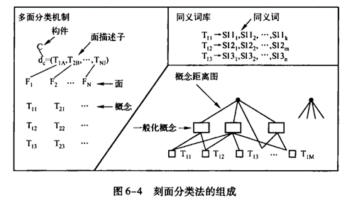

# [Faceted Classification] 刻面分类法

在刻面分类机制中，定义若干用于刻画构件特征的```面（Facet）```，即```刻面```，每个刻面
由一组基本的术语（即关键字）构成（成为术语空间），这些术语表述构件在刻面上的特征。因此，一个构件执行
的功能、被操作的数据、构件应用的语境或其他特征可以被每个刻面中的一个或多个术语所刻画。

刻面分类法具有以下特性：

1. 刻面必须充分并且明确地描述构件库中的**全体构件**，即每一个构件都可以用该刻面来分类。
2. 每一个刻面与一个术语空间相关联。任意两个刻面地**术语空间是正交**的，即一个刻面的术语发生变化不会影响另一个刻面的术语空间。
3. 一个刻面的术语空间为**有限的不定空间（Finite & Indefinite Space）**，即可以**动态**增加和删除术语。
4. 每一个构件的**所有刻面都必须给予定义**，不允许在构件分类时有未定义的刻面。查询时，用户可以利用任意数目的刻面。
5. 构件库管理者对构件进行分类时，应该针对每一个刻面，从术语空间中选择适当的（多个）术语，以完成构件的封装工作。
6. 在一个术语空间中的术语按一般或特殊关系形成**树状**的层次结构，每一个术语附带不定数目的同义词（术语间可以具有同义词关系）


**刻面分类方法由3部分构成**：多面分类机制、同义词库和概念距离图：



采用刻面分类进行可复用构件库的组织，必须在存储软件构件的同时，表示并存储多面分类机制、同义词库和概念距离图。
例如，可以采用关系数据库中的表格来描述它们。多面分类法的所有语法构件（”面“，”概念“，同义词，一般化概念，差异性权值）
均取材于论域分析的结果。当需要在可复用组件库中加入新的构件时，构件库管理员必须对构件的功能、行为进行深入分析，利用现有的多面分类结构确定构件
的描述子，对每个”面“选取合适的”概念“座位特征描述。必要时可以考虑增加新的”概念“，此时必须根据新”概念“完善同义词库和概念距离图。


## 多面分类机制

分析论域范围并定义用于描述一个构件特征的”面“，每个”面“包含若干”概念“，它们表述构件在”面“上的基础特征。这些特征根据它们的重要性排列。
“面”可以描述构件执行的功能、被操作的数据、构件应用的上下文以及任何其他特征。描述某一构件的“面”的集合成为面描述子。通常，面的描述个数为7~8个为好。

作为一个简单的构件分类中使用“面”的例子，面描述子的模式可以是：

$${功能，对象类型，系统类型}$$

面描述子中每一个“面”可包含一个或多个特征值，这些值一般是描述性的关键词。例如，若功能（Function）是某一个构件的一个面，
则赋予此面的典型值可能是：

$$Function = (copy,form) or (copy, replace, all)$$

使用多重面特征值可使原始的函数copy充分地细化。

## 同义词库

意义相同或相近的若干词汇组成同义词库。所有词汇按照隶属于“面”的“概念”分组，在任一时刻，每个“概念”可用组内的某一
同义词作为标识载体。

## 概念距离图

概念距离图用于度量每个“面”中“概念”的相似性程度。属于每个“面”的一般化概念与其中的两个或多个“概念“以加权边相连接，
两个”概念“的相似性由它们之间的最短加权路劲上的加权距离确定，附加于边上的权值体现了”概念“之间的差异程度。

