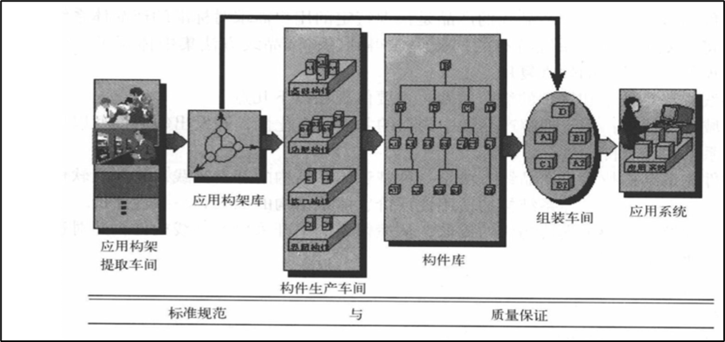

# [Product Line Composition] （青鸟）产品线构成

一个软件产品线：是一组具有公共需求的软件系统，这些需求是针对一类特定的商业
行为和任务的，或者说是一组共享公共设计和标准（构件）的产品族。

包含”3个3“：
- **三个车间**：构架生产车间、构件生产车间、产品组装车间
- **三类人员**：构架生产者、构件生产者、产品组装者
- **三种仓库**：构架仓库、构件仓库、产品仓库

