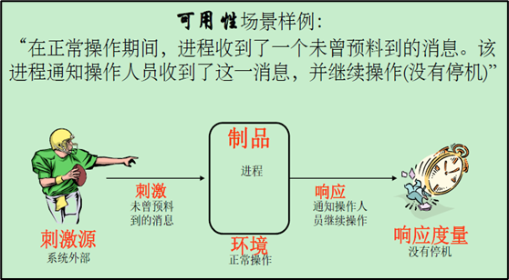
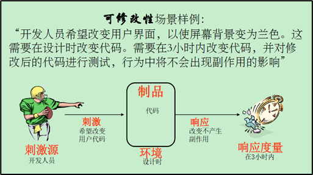
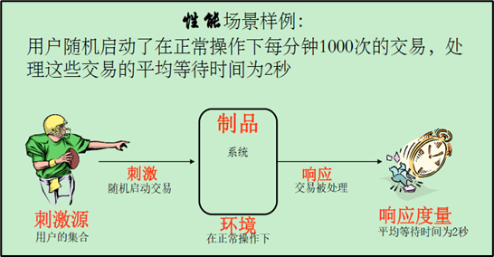
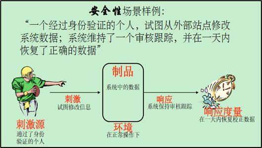
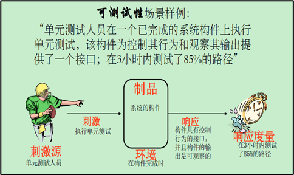
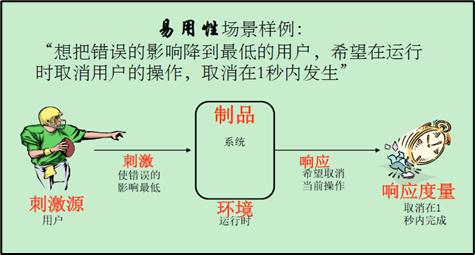

# [Software Quality Attributes] 软件质量属性

## 可用性

可用性与系统故障及其后果相关。当系统不再提供其规范中所说的服务时，就出现了系统故障。系统用户可以观察到此类故障。
可用性是指系统正常运行时间的比例，是通过两次故障之间的时间长度或在系统崩溃情况下能够恢复正常运行的速度来衡量的。

## 可修改性

可修改性是变更的成本问题。其两个关注点：可以修改什么（物体）？何时以及谁进行修改（环境）。

## 性能

性能是与时间相关，基本上与事件发生时，系统在多长时间内作出了响应。事件（中断、消息、用户请求或时间已到）发生时，系统必须对其做出响应。

## 安全性

安全性是衡量系统在合法用户正常提供服务的情况下，阻止非授权使用的能力。试图突破安全防线的行为被称为”攻击“。攻击有以下三种方式：

- 未经授权试图访问数据或服务
- 未经授权试图修改数据
- 试图使用系统拒绝向合法用户提供服务

## 可测试性

指通过测试揭示软件缺陷的难易程度（通常是基于运行的测试）。特别地，假设软件中至少有一个错误，
软件在下次测试运行时不能正常工作的可能性。

可测试性的响应度量处理的是测试在发现缺陷方面的效率以及想要达到某个期望的覆盖范围，需要用多长时间进行测试。

## 易用性

关注的是对用户来说完成某个期望任务的难易程度。分为以下几个方面：有效新、错误避免以及错误处理、用户自信和满意度、可学习性。

