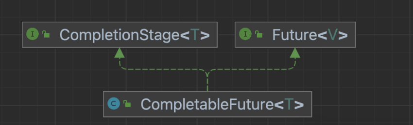
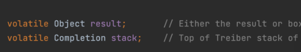
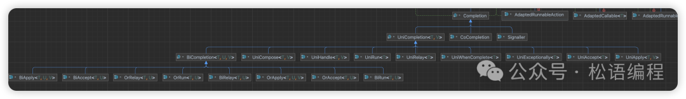
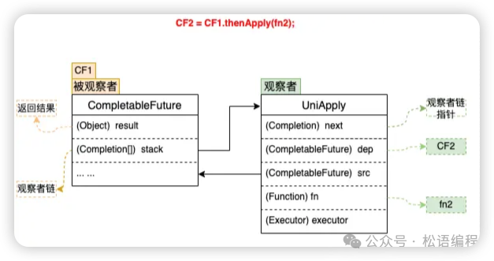
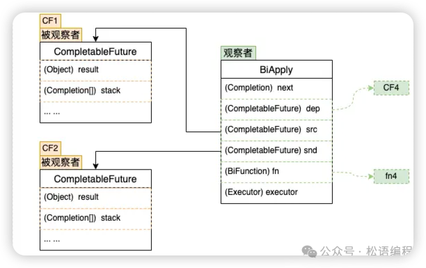
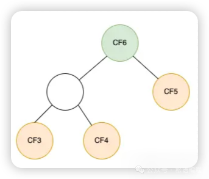
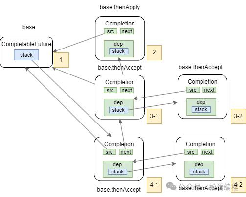

# CompletableFuture：异步编程利器原理深究

## Completable Future 的结构

既然CompletableFuture这么好用，那么它的原理是什么？下面我们一起来看看。CompletableFuture实现了两个接口，如下图所示：Future、CompletionStage。




- **Future** 接口代表了一个异步计算的结果，也就是说，它代表了某个未来可能完成的计算结果。Future接口提供了获取结果、检查是否完成、取消任务等方法。
- **CompletionStage** 用于表示异步执行过程中的一个步骤（Stage），这个步骤可能是由另外一个CompletionStage触发的，随着当前步骤的完成，也可能会触发其他一系列CompletionStage的执行。从而我们可以根据实际业务对这些步骤进行多样化的编排组合，CompletionStage接口正是定义了这样的能力，我们可以通过其提供的thenAppy、thenCompose等函数式编程方法来组合编排这些步骤.

CompletableFuture中包含两个字段：result和stack。



- **result** 用于存储当前CF的结果。
- **stack（Completion）** 表示当前CF完成后需要触发的依赖动作，去触发依赖它的CF的计算，依赖动作可以有多个（表示有多个依赖它的CF），以栈的形式存储，stack表示栈顶元素。

这种方式类似“观察者模式”，依赖动作（Dependency Action）都封装在一个单独Completion子类中。CompletableFuture中的每个方法都对应了图中的一个Completion的子类，Completion本身是观察者的基类。




## CompletableFuture 的设计思想

按照类似“观察者模式”的设计思想，原理分析从“观察者”和“被观察者”两个方面着手。由于回调种类多，但结构差异不大，所以这里以一元依赖中的thenApply为例。



### 被观察者

1. 每个CompletableFuture都可以被看作一个被观察者，其内部有一个Completion类型的链表成员变量stack，用来存储注册到其中的所有观察者。当被观察者执行完成后会弹栈stack属性，依次通知注册到其中的观察者。上面例子中步骤fn2就是作为观察者被封装在UniApply中。
2. 被观察者CF中的result属性，用来存储返回结果数据。这里可能是一次RPC调用的返回值，也可能是任意对象，在上面的例子中对应步骤fn1的执行结果。

### 观察者

CompletableFuture支持很多回调方法，例如thenAccept、thenApply、exceptionally等，这些方法接收一个函数类型的参数f，生成一个Completion类型的对象（即观察者），并将入参函数f赋值给Completion的成员变量fn，然后检查当前CF是否已处于完成状态（即result != null），如果已完成直接触发fn，否则将观察者Completion加入到CF的观察者链stack中，再次尝试触发，如果被观察者未执行完则其执行完毕之后通知触发。

1. 观察者中的dep属性：指向其对应的CompletableFuture，在上面的例子中dep指向CF2。
2. 观察者中的src属性：指向其依赖的CompletableFuture，在上面的例子中src指向CF1。
3. 观察者Completion中的fn属性：用来存储具体的等待被回调的函数。这里需要注意的是不同的回调方法（thenAccept、thenApply、exceptionally等）接收的函数类型也不同，即fn的类型有很多种，在上面的例子中fn指向fn2。

## 整体流程

### 一元依赖

以thenApply为例来说明一元依赖的流程：

1. 将观察者Completion注册到CF1，此时CF1将Completion压栈。
2. 当CF1的操作运行完成时，会将结果赋值给CF1中的result属性。
3. 依次弹栈，通知观察者尝试运行。

### 二元依赖

thenCombine操作表示依赖两个CompletableFuture。其观察者实现类为BiApply，BiApply通过src和snd两个属性关联被依赖的两个CF，fn属性的类型为BiFunction。与单个依赖不同的是，在依赖的CF未完成的情况下，thenCombine会尝试将BiApply压入这两个被依赖的CF的栈中，每个被依赖的CF完成时都会尝试触发观察者BiApply，BiApply会检查两个依赖是否都完成，如果完成则开始执行。





### 多元依赖

依赖多个CompletableFuture的回调方法包括allOf、anyOf，区别在于allOf观察者实现类为BiRelay，需要所有被依赖的CF完成后才会执行回调；而anyOf观察者实现类为OrRelay，任意一个被依赖的CF完成后就会触发。二者的实现方式都是将多个被依赖的CF构建成一棵平衡二叉树，执行结果层层通知，直到根节点，触发回调监听。




### 执行流程

```Java
CompletableFuture<String> base = new CompletableFuture<>();
CompletableFuture<String> future =
        base.thenApply(
                s -> {
                    System.out.println("2");
                    return s + " 2";
                });
base.thenAccept(s -> System.out.println("3-1")).thenAccept(aVoid -> System.out.println("3-2"));
base.thenAccept(s -> System.out.println("4-1")).thenAccept(aVoid -> System.out.println("4-2"));
base.complete("1");
System.out.println("base result: "+ base.join());
System.out.println("future result: "+ future.join());
```

我们分解执行步骤：

1. base.complete("1")后base里的result属性会变成1
2. 取base中stack（对象4-1）执行，出栈
3. 取对象1中dep属性的stack（对象4-2）执行，出栈
4. 取base中stack（对象3-1）执行，出栈
5. 取对象3中dep属性的stack（对象3-2）执行，出栈
6. 取base中stack（对象2）执行，出栈
   最终stack之间的引用关系如何所示：




